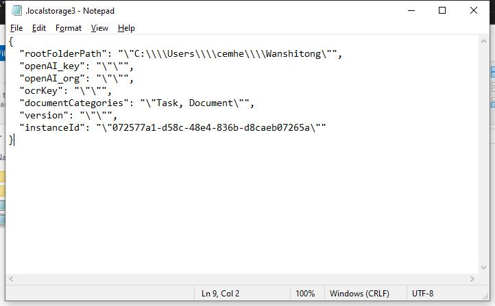
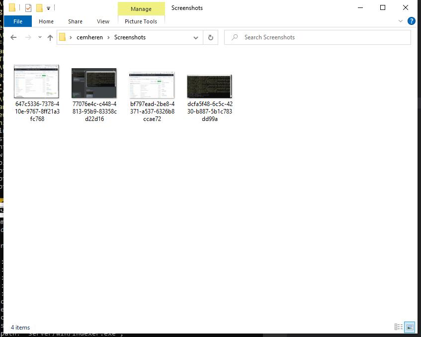

[](https://dev.azure.com/akifheren/wanshitong/_build/latest?definitionId=1&branchName=master)

# wanshitong
Open source Scribe alternative. I believed this to be a great way of indexing one's workflow, however decluttering becomes an issue once there are too much information. 

This project aims to help create a new type of workflow around note taking and documentation creating. We focus on capturing information quickly and indexing it for later use. 

Newly integrated with Open AI chat GPT APIs to get better performance on indexing and auto organizing.  

## Whys

* A lot of note taking and documentation apps require too much manual work 
* Document creation should be easy and spontaneous. Shouldn't require one to switch context. 
* We see so much information, it's hard to predict what will be useful later. It's better to save now and filter later. 
* Alternatives like Evernote don't focus on ease of use/timeline type of experience. 

## Features
* Easily create documents, use the shortcut `alt+A` to index the application in focus. Or `alt+c` to index whatever is in the clipboard. 
* Extensible search: you can use any elastic search query to search indexed documents. 
* Pivoting: Create saved searches around common search terms or interesting queries. Saved searches are updated with any new document created that matches the criteria
* Timeline: When you click open a document, a timeline view appears underneath; allowing access to any other documents that were captured around that time. This way we can search for documents that doesn't contain the keywords we are looking for and capture contextual clues. 
* Tagging: When keyword searches aren't enough, right click a document to add a tag. Tags go through a completely new index and they are searchable with a special syntax `tags:test`
* Automatically categorize and tag documents using chat GPT. 

## Latest release
Latest Windows release and installer can be found here: 
https://allbuilds.blob.core.windows.net/wanshitong/latest/librarian.exe

For MacOS there are no automated builds due to Apple's signing requirements. 
You can manually build and run the tool.

## How to build and run locally

To run locally you need to fill up connectionString settings in `user/Wanshitong/.localstorage`. 


By default connection strings are empty and the indexer will not function. 

### Server
Indexer is a dotnet project so you need `dotnet core 8` to build and run it. 

```
cd Indexer
dotnet run
```

The indexer should be running by default at ` http://localhost:4153`


### Frontend

From a new command window `cd Electron` to change into the electron directory. 
```
npm install
npm start
```

## Screenshots and usage

If you manage to run both the Electron UX project and the indexer you can start capturing screenshots using `alt+A` hotkey. 


## Where is the data

Wanshitong will only save your information locally in two folders. Alternatively you can set the root folder in `user/Wanshitong/.localstorage` to point to any other directory. You can point to dropbox or any other alternative cloud file system to back your index up online. (Or share with teammates)

Screenshots in `user/Wanshitong/Screenshots` and the index in `user/Wanshitong/index`: 




## How to migrate to a new computer

Simply copy your Index and Screenshots folders into your new PC and run the project. All your saved indexes should be there. 

